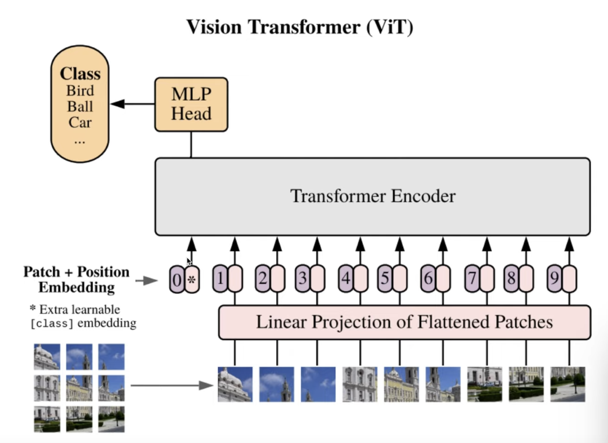

# ViT study notes


## Model Architecture

### Overview

- Input
  - Image is divided into patches
  - Each patch is flattened and linearly transformed to a fixed dimension (this dimesion is often called the embedding dimension)
  - A class token is added to the sequence
    - The class token is a learnable parameter that is added to the sequence of patches, not a ground truth label
- Output
  - The first token of the sequence is used as the output of the model. This token is often called the class token, and should contain all the information needed to classify the image, since it has access to the entire sequence of patches.
  - The class token is passed through a linear layer to get the final output of the model.

**Forward Function**
```python
images = ... # torch.size([8, 3, 224, 224]) (batch size, channels, height, width)
x = images

def forward(self, x: torch.Tensor):
    # Reshape and permute the input tensor

    print(x.shape)
    #>>> x = torch.size([8, 3, 224, 224])

    # 1. cut up x into patches.
    # 2. flatten them out, and add a positional embedding
    # 3. add a class token
    x = self._process_input(x) 

    print(x.shape)
    #>>> x = torch.size([8, 196, 768])
    # 16 x 16 patches = 196 patches, each with 768 dimensions

    # get the batch size
    n = x.shape[0]

    # Expand the class token to the full batch
    batch_class_token = self.class_token.expand(n, -1, -1)
    x = torch.cat([batch_class_token, x], dim=1)
    print(x.shape)
    #>>> x = torch.size([8, 197, 768])
    # the class token is added to the sequence, so now we have 197 patchess

    # pass the sequence through the encoder model of the transformer
    x = self.encoder(x)
    print(x.shape)
    #>>> x = torch.size([8, 197, 768])
    # the output of the encoder is the same shape as the input
    
    # Classifier "token" as used by standard language architectures
    x = x[:, 0]
    print(x.shape)
    #>>> x = torch.size([8, 768])

    # pass the class token through the heads of the model
    x = self.heads(x)
    print(x.shape)
    #>>> x = torch.size([8, 1000])
    
    # the output of the heads is the final output of the model
    return x
```

**Making the Patches**
```python
def _process_input(self, x: torch.Tensor) -> torch.Tensor:
    n, c, h, w = x.shape
    p = self.patch_size
    torch._assert(h == self.image_size, f"Wrong image height! Expected {self.image_size} but got {h}!")
    torch._assert(w == self.image_size, f"Wrong image width! Expected {self.image_size} but got {w}!")
    n_h = h // p
    n_w = w // p

    # (n, c, h, w) -> (n, hidden_dim, n_h, n_w)
    '''
    The convolutional projection layer is actually just a normal Conv2d layer with an interesting configuration of  kernel_size == stride == patch_size. This allows the layer to cut the image into patches.

    The kernel weights used to project the image patches into the embedding space are the same for each patch. 
    '''
    x = self.conv_proj(x)
    # (n, hidden_dim, n_h, n_w) -> (n, hidden_dim, (n_h * n_w))
    x = x.reshape(n, self.hidden_dim, n_h * n_w)

    # (n, hidden_dim, (n_h * n_w)) -> (n, (n_h * n_w), hidden_dim)
    # The self attention layer expects inputs in the format (N, S, E)
    # where S is the source sequence length, N is the batch size, E is the
    # embedding dimension
    x = x.permute(0, 2, 1)

    return x
```

**The Transfomer Part**
```python
class Encoder(nn.Module):
    """Transformer Model Encoder for sequence to sequence translation."""

    def __init__(
        self,
        seq_length: int,
        num_layers: int,
        num_heads: int,
        hidden_dim: int,
        mlp_dim: int,
        dropout: float,
        attention_dropout: float,
        norm_layer: Callable[..., torch.nn.Module] = partial(nn.LayerNorm, eps=1e-6),
    ):
        super().__init__()
        # Note that batch_size is on the first dim because
        # we have batch_first=True in nn.MultiAttention() by default
        self.pos_embedding = nn.Parameter(torch.empty(1, seq_length, hidden_dim).normal_(std=0.02))  # from BERT
        self.dropout = nn.Dropout(dropout)
        layers: OrderedDict[str, nn.Module] = OrderedDict()
        for i in range(num_layers):
            layers[f"encoder_layer_{i}"] = EncoderBlock(
                num_heads,
                hidden_dim,
                mlp_dim,
                dropout,
                attention_dropout,
                norm_layer,
            )
        self.layers = nn.Sequential(layers)
        self.ln = norm_layer(hidden_dim)

    def forward(self, input: torch.Tensor):
        torch._assert(input.dim() == 3, f"Expected (batch_size, seq_length, hidden_dim) got {input.shape}")
        '''
        Add the positiona; emebedding to the input. The position embedding is a learnable parameter that is added to the input.

        The positional embedding is 1-d and not 2-d. The model is able to learn that the input image is 2-dimensional and not a 1-d sequence on its own.
        '''
        input = input + self.pos_embedding
        return self.ln(self.layers(self.dropout(input)))

class EncoderBlock(nn.Module):
    """Transformer encoder block."""

    def __init__(
        self,
        num_heads: int,
        hidden_dim: int,
        mlp_dim: int,
        dropout: float,
        attention_dropout: float,
        norm_layer: Callable[..., torch.nn.Module] = partial(nn.LayerNorm, eps=1e-6),
    ):
        super().__init__()
        self.num_heads = num_heads

        # Attention block
        self.ln_1 = norm_layer(hidden_dim)
        self.self_attention = nn.MultiheadAttention(hidden_dim, num_heads, dropout=attention_dropout, batch_first=True)
        self.dropout = nn.Dropout(dropout)

        # MLP block
        self.ln_2 = norm_layer(hidden_dim)
        self.mlp = MLPBlock(hidden_dim, mlp_dim, dropout)

    def forward(self, input: torch.Tensor):
        torch._assert(input.dim() == 3, f"Expected (batch_size, seq_length, hidden_dim) got {input.shape}")
        x = self.ln_1(input)
        x, _ = self.self_attention(x, x, x, need_weights=False)
        x = self.dropout(x)
        x = x + input

        y = self.ln_2(x)
        y = self.mlp(y)
        return x + y
```
### VIT_B_16 Example

execution stack
1. `vit_b_16()`
   1. `ViT_B_16_Weights.verify(weights)`: verifies the weights
   2. `_vision_transformer(patch_size=16,num_layers=12,num_heads=12,hidden_dim=768,mlp_dim=3072,weights=weights,progress=progress,**kwargs,)`:a function to build the visio n transformer. It overwrites the params of the output layer to match the number of classes, and instantiates the VisionTransfomer class.
      1. `VisionTransformer(image_size=image_size,patch_size=patch_size,num_layers=num_layers,num_heads=num_heads,hidden_dim=hidden_dim,mlp_dim=mlp_dim,**kwargs,)`: The VisionTransformer Class

Entire Vision Transformer Class:
```python
class VisionTransformer(nn.Module):
    """Vision Transformer as per https://arxiv.org/abs/2010.11929."""

    def __init__(
        self,
        image_size: int,
        patch_size: int,
        num_layers: int,
        num_heads: int,
        hidden_dim: int,
        mlp_dim: int,
        dropout: float = 0.0,
        attention_dropout: float = 0.0,
        num_classes: int = 1000,
        representation_size: Optional[int] = None,
        norm_layer: Callable[..., torch.nn.Module] = partial(nn.LayerNorm, eps=1e-6),
        conv_stem_configs: Optional[List[ConvStemConfig]] = None,
    ):
        super().__init__()
        _log_api_usage_once(self)
        torch._assert(image_size % patch_size == 0, "Input shape indivisible by patch size!")
        self.image_size = image_size
        self.patch_size = patch_size
        self.hidden_dim = hidden_dim
        self.mlp_dim = mlp_dim
        self.attention_dropout = attention_dropout
        self.dropout = dropout
        self.num_classes = num_classes
        self.representation_size = representation_size
        self.norm_layer = norm_layer

        if conv_stem_configs is not None:
            # As per https://arxiv.org/abs/2106.14881
            seq_proj = nn.Sequential()
            prev_channels = 3
            for i, conv_stem_layer_config in enumerate(conv_stem_configs):
                seq_proj.add_module(
                    f"conv_bn_relu_{i}",
                    Conv2dNormActivation(
                        in_channels=prev_channels,
                        out_channels=conv_stem_layer_config.out_channels,
                        kernel_size=conv_stem_layer_config.kernel_size,
                        stride=conv_stem_layer_config.stride,
                        norm_layer=conv_stem_layer_config.norm_layer,
                        activation_layer=conv_stem_layer_config.activation_layer,
                    ),
                )
                prev_channels = conv_stem_layer_config.out_channels
            seq_proj.add_module(
                "conv_last", nn.Conv2d(in_channels=prev_channels, out_channels=hidden_dim, kernel_size=1)
            )
            self.conv_proj: nn.Module = seq_proj
        else:
            self.conv_proj = nn.Conv2d(
                in_channels=3, out_channels=hidden_dim, kernel_size=patch_size, stride=patch_size
            )

        seq_length = (image_size // patch_size) ** 2

        # Add a class token
        self.class_token = nn.Parameter(torch.zeros(1, 1, hidden_dim))
        seq_length += 1

        self.encoder = Encoder(
            seq_length,
            num_layers,
            num_heads,
            hidden_dim,
            mlp_dim,
            dropout,
            attention_dropout,
            norm_layer,
        )
        self.seq_length = seq_length

        heads_layers: OrderedDict[str, nn.Module] = OrderedDict()
        if representation_size is None:
            heads_layers["head"] = nn.Linear(hidden_dim, num_classes)
        else:
            heads_layers["pre_logits"] = nn.Linear(hidden_dim, representation_size)
            heads_layers["act"] = nn.Tanh()
            heads_layers["head"] = nn.Linear(representation_size, num_classes)

        self.heads = nn.Sequential(heads_layers)

        if isinstance(self.conv_proj, nn.Conv2d):
            # Init the patchify stem
            fan_in = self.conv_proj.in_channels * self.conv_proj.kernel_size[0] * self.conv_proj.kernel_size[1]
            nn.init.trunc_normal_(self.conv_proj.weight, std=math.sqrt(1 / fan_in))
            if self.conv_proj.bias is not None:
                nn.init.zeros_(self.conv_proj.bias)
        elif self.conv_proj.conv_last is not None and isinstance(self.conv_proj.conv_last, nn.Conv2d):
            # Init the last 1x1 conv of the conv stem
            nn.init.normal_(
                self.conv_proj.conv_last.weight, mean=0.0, std=math.sqrt(2.0 / self.conv_proj.conv_last.out_channels)
            )
            if self.conv_proj.conv_last.bias is not None:
                nn.init.zeros_(self.conv_proj.conv_last.bias)

        if hasattr(self.heads, "pre_logits") and isinstance(self.heads.pre_logits, nn.Linear):
            fan_in = self.heads.pre_logits.in_features
            nn.init.trunc_normal_(self.heads.pre_logits.weight, std=math.sqrt(1 / fan_in))
            nn.init.zeros_(self.heads.pre_logits.bias)

        if isinstance(self.heads.head, nn.Linear):
            nn.init.zeros_(self.heads.head.weight)
            nn.init.zeros_(self.heads.head.bias)

    def _process_input(self, x: torch.Tensor) -> torch.Tensor:
        n, c, h, w = x.shape
        p = self.patch_size
        torch._assert(h == self.image_size, f"Wrong image height! Expected {self.image_size} but got {h}!")
        torch._assert(w == self.image_size, f"Wrong image width! Expected {self.image_size} but got {w}!")
        n_h = h // p
        n_w = w // p

        # (n, c, h, w) -> (n, hidden_dim, n_h, n_w)
        x = self.conv_proj(x)
        # (n, hidden_dim, n_h, n_w) -> (n, hidden_dim, (n_h * n_w))
        x = x.reshape(n, self.hidden_dim, n_h * n_w)

        # (n, hidden_dim, (n_h * n_w)) -> (n, (n_h * n_w), hidden_dim)
        # The self attention layer expects inputs in the format (N, S, E)
        # where S is the source sequence length, N is the batch size, E is the
        # embedding dimension
        x = x.permute(0, 2, 1)

        return x

    def forward(self, x: torch.Tensor):
        # Reshape and permute the input tensor
        x = self._process_input(x)
        n = x.shape[0]

        # Expand the class token to the full batch
        batch_class_token = self.class_token.expand(n, -1, -1)
        x = torch.cat([batch_class_token, x], dim=1)

        x = self.encoder(x)

        # Classifier "token" as used by standard language architectures
        x = x[:, 0]

        x = self.heads(x)

        return x
```

## Additional Material
- https://www.youtube.com/watch?v=gZpqXpcwT24&list=WL&index=5&ab_channel=MakGaiduk